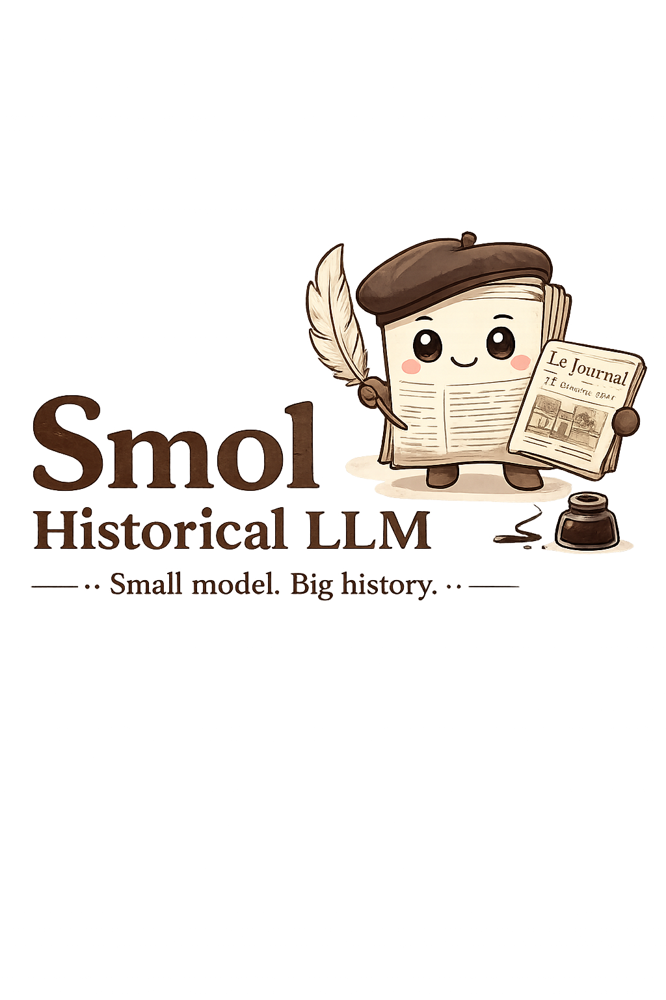

# Historical LLM

  

  <em>Logo generated with AI.</em>

A small experiment for adapting LLMs to historical text.

This repository contains a training script for continued pretraining / domain adaptation of `HuggingFaceTB/SmolLM3-3B-Base` and several BERT models.
